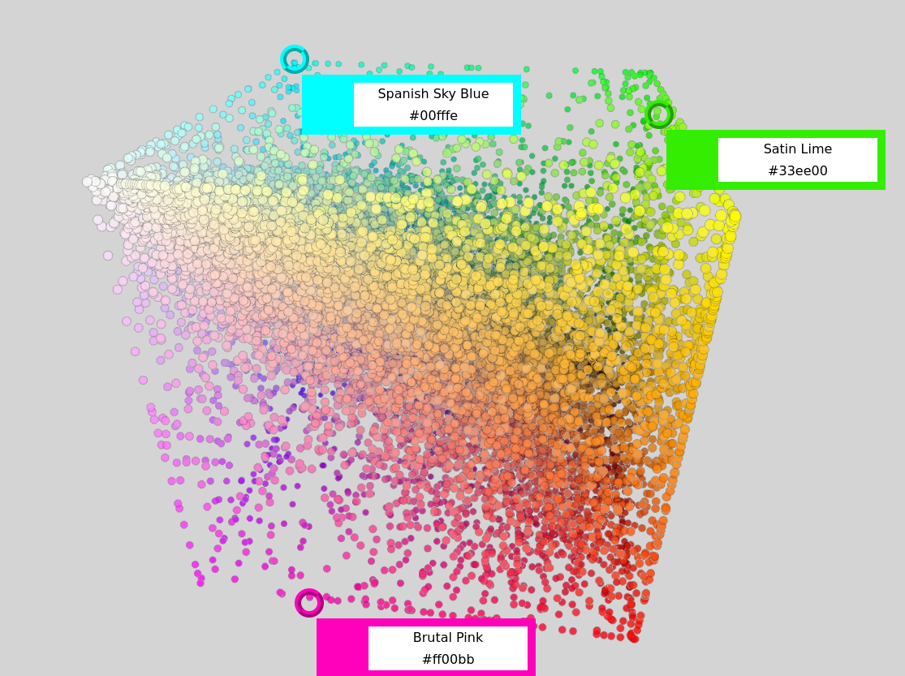

# colori3d
3d point cloud viewer

This exercise is about Three.js. There are many good html viewers of a point cloud, this is not the best one, but a test for a more complex application.
The page should be served by a webserver in order to work.
